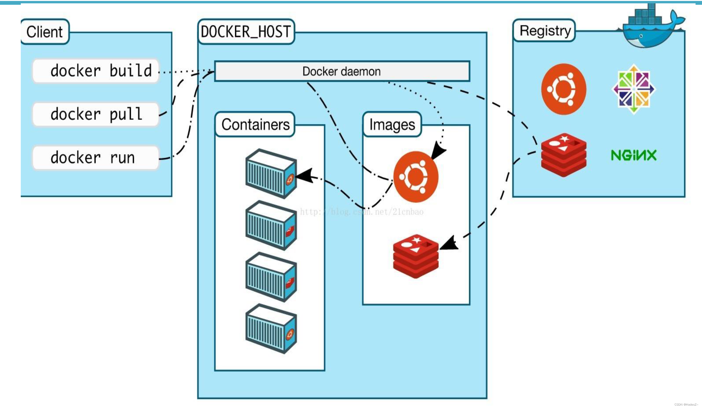

# Docker的简介

### 准备：基础名词解释

- 镜像（Image）：镜像是容器的基础，它是一个只读的模板，包含了运行容器所需的完整文件系统、应用程序代码和依赖项。可以通过Docker镜像来构建和创建容器。

- 容器：容器是从镜像创建的运行实例，它可以被启动、停止、删除和管理。容器提供了一个隔离的运行环境，使应用程序在其中运行，并且不会相互影响。多个容器可以同时运行在同一台宿主机上。

- Docker引擎（Engine）：Docker引擎是Docker的核心组件，负责管理容器的生命周期、构建和运行镜像，以及提供容器之间的通信和网络连接等功能。

- Docker仓库（Registry）：仓库是用于存储和分享Docker镜像的地方。Docker官方提供了Docker Hub作为默认的公共仓库，开发者可以从中获取各种镜像。此外，还可以搭建私有的仓库来存储自己的镜像，在国内就要配置镜像加速个maven类似。

为了简单的理解这些概念，你可以把镜像和容器的关系理解成java里的类和对象，镜像就是类，容器就是镜像创建的对象，java里一般类是抽象出来的模板，我们要使用他就要创建具体的对象，docker也是这样，我们打包的镜像创建出容器后，我们就可以通过容器来使用命令来运行项目了（可以理解成小型的Linux系统）

### docker概念图

### 1.什么是docker

Docker是一种基于go语言开发的开源的容器化平台，用于构建、发布和运行应用程序。它提供了一种轻量级的容器化解决方案，使开发者能够将应用程序及其依赖项打包成一个独立的、可移植的容器，无论在哪个环境中都能保持一致的运行方式。

Docker的核心概念是容器（Container），它是一个可执行的软件包，包含了运行应用程序所需的所有组件，包括代码、运行时环境、系统工具、库文件等。容器提供了一种隔离的运行环境，使应用程序能够在不同的操作系统和硬件平台上以相同的方式运行。

docker官网：`https://www.docker.com/`

docker仓库官网：`https://hub-stage.docker.com/`

### 2.docker的历史

1. Linux容器技术：Docker的技术基础可以追溯到Linux操作系统提供的容器技术。Linux容器是一种轻量级虚拟化技术，通过Linux内核的命名空间和控制组（cgroups）功能，实现了进程级别的隔离和资源管理。这些技术为Docker的容器化解决方案提供了基础。

2. dotCloud公司：Docker最初由一家名为dotCloud的公司开发，该公司是一家云服务提供商。在开发过程中，他们意识到构建和部署应用程序的过程非常复杂和耗时，因此开始探索一种更简化的解决方案。

3. Docker引擎的发布：2013年，dotCloud公司发布了Docker引擎，这是一个开源的容器运行时环境。Docker引擎建立在Linux容器技术之上，并通过添加用户友好的工具和接口，使容器的创建、管理和交付变得更加简单和可靠。

4. 快速采纳和生态系统的建立：Docker引擎的发布引起了广泛的关注和采纳。由于其创新性和便利性，Docker迅速成为容器化技术的事实标准，并吸引了大量的开发者和企业的关注。这导致了一个庞大的Docker生态系统的建立，包括各种工具、平台和服务的支持。

5. Docker化的应用程序交付和部署：Docker的出现改变了应用程序交付和部署的方式。通过将应用程序及其依赖项打包成一个独立的容器，Docker提供了一种可移植、一致和可重复部署的解决方案。这使得开发者可以更快速、高效地交付应用程序，并提供了更好的可靠性和可扩展性。

### 3.docker能干什么

简单来说就是更方便的部署项目，从前部署项目十分繁琐要去配各种各样的环境，可能出现项目在我的电脑环境能运行，在你的电脑不能运行，因为往往我们在windows写的项目要在linux系统上运行，我们往往把windows上项目打成jar包，在发到Linux系统上，然后在Linux上安装相应的环境，在这个过程中，可能有版本，系统冲突等等的错误，为此docker出现了，他致力于把jar包和运行环境封装在一起，这样我就可以把正确的应用程序交到linux系统上而不用担心环境的问题，把应用程序和他所需的环境封装在一起就称为一个容器。

在传统虚拟化技术中，如虚拟机，整个操作系统和应用程序运行环境被模拟为一个独立的虚拟机实例。这包括模拟硬件、操作系统和应用程序运行时，因此每个虚拟机都是一个完整的、耦合的环境。如果需要隔离应用程序，通常需要创建多个虚拟机实例，这会导致较高的资源开销。

相比之下，Docker采用了轻量级的容器化技术。容器化只模拟了核心的部分，即应用程序和其所需的运行时环境，而不需要模拟整个操作系统。每个容器都是独立的运行实例，具有自己的文件系统、进程空间和网络接口。这种轻量级的隔离使得容器可以更高效地利用系统资源，并且容器之间的隔离性更好。

因此，使用Docker，您可以在单个物理或虚拟机上运行多个容器，每个容器都有自己的应用程序和依赖项，彼此之间相互隔离。这种隔离性使得容器可以更灵活地部署和管理应用程序，而无需为每个应用程序创建独立的虚拟机实例。

### 4.docker的优点

1. 更快的交付与部署：

传统方式：以前我们在部署应用程序时，需要编写详细的说明文档，并手动安装和配置各种环境。这个过程非常繁琐，耗时较长。

Docker方式：现在有了Docker，我们可以将应用程序和所需的环境一起打包成一个文件，就像打包一个礼物一样简单。只需要运行这个文件，应用程序就能快速部署起来，大大节省了时间和精力。

2. 更便捷的扩缩容：

传统方式：以前，如果我们想要增加应用程序的能力，需要手动进行一系列繁琐的操作，比如添加新的服务器、调整配置等。这个过程需要花费很多时间和精力。

Docker方式：现在，有了Docker，我们可以轻松地扩展应用程序的能力。只需要几个简单的命令，就能快速地启动或停止多个应用程序实例，非常方便。这样，我们可以根据需要灵活地调整应用程序的规模。

3. 更简单的系统运维：

传统方式：以前，系统运维工作非常繁琐，需要手动配置、更新和维护各种环境和应用程序。这个过程复杂而容易出错。

Docker方式：现在，有了Docker，系统运维变得简单多了。我们只需要将应用程序打包成一个容器，然后就可以在不同的环境中轻松部署和运行。通过一些简单的命令，我们可以自动化地构建、部署和更新应用程序，大大简化了运维的工作量。

4. 更高效的系统计算资源利用：

传统方式：以前，我们为每个应用程序提供独立的服务器或虚拟机，这样会造成资源的浪费，因为每个服务器都需要独立的操作系统和运行环境。

Docker方式：现在，有了Docker，我们可以更高效地利用系统资源。通过将应用程序打包成容器，我们可以在同一台机器上运行多个容器，共享机器的资源。这样可以减少资源的浪费，提高系统的资源利用率。而且，容器的启动和停止非常快速，可以根据需要灵活调整容器的数量，更好地利用系统的计算能力。
