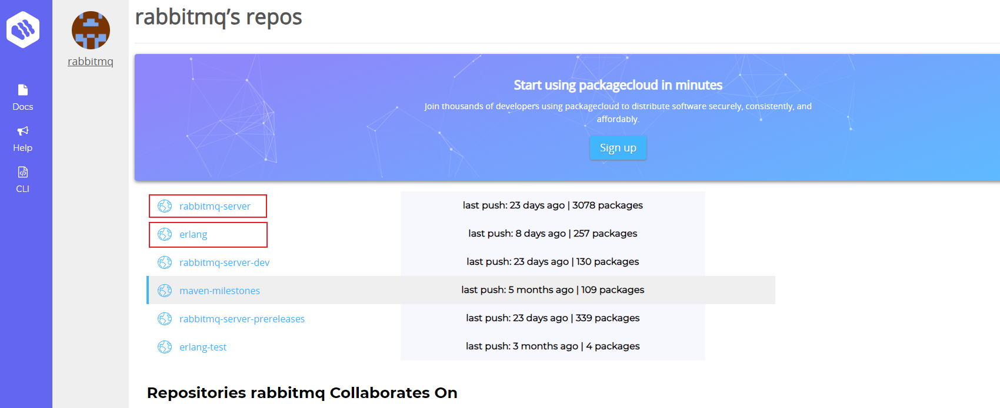
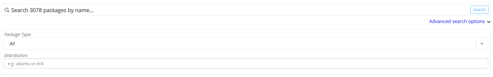
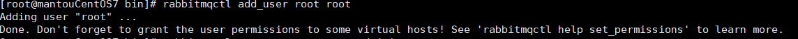

我的虚拟机操作系统是centos7

安装RabbitMQ首先需要erlang的支持，毕竟RabbitMQ是基于erlang语言开发的

## rpm的安装方式

`https://packagecloud.io/rabbitmq`

在这个网址可以下载到RabbitMQ和erlang

在上面的搜索框可以搜索到自己的对应的操作系统的rpm包

注意erlang的版本要和RabbitMQ的版本对应

下面是版本信息的网址

`https://www.rabbitmq.com/docs/which-erlang`

在下载完成后用远程方式把rpm包传到虚拟机中，可以用xftp

如果操作系统是最小化安装，需要额外安装环境依赖：yum install build-essential openssl openssl-devel unixODBC unixODBC-devel make gcc gcc-c++ kernel-devel m4 ncurses-devel tk tc xz
利用`rpm -ivh [rpm包的名称]`来安装erlang和rabbitmq，先安装erlang再安装RabbitMQ

如果虚拟机没有socat 可以用`sudo yum install socat`来安装

在成功安装好erlang 和 RabbitMQ后

`systemctl start rabbitmq-server`可以启动RabbitMQ

`systemctl status rabbitmq-server`可以查看RabbitMQ的启动状态

`systemctl stop rabbitmq-server` 停止服务 

### rabbitmq管理界面

先安装管理界面的插件

 `rabbitmq-plugins enable rabbitmq_management`

在浏览器上输入自己的ip地址加端口号15672,记得开放5672和15672这两个端口

例如`192.168.168.134:15672`就可以进入管理界面 默认用户名和密码都是guest，但是只等本机登录，所以我们要创建一个可以远程登录的用户

创建账号和密码

`rabbitmqctl add_user [用户名] [密码]`

设置用户角色administrator（管理员）

`rabbitmqctl set_user_tags [用户名] [角色]`

为用户添加资源权限，添加配置、写、读权限

`rabbitmqctl set_permissions -p "/" [用户名] ".*" ".*" ".*"`

修改用户密码
`rabbitmqctl  change_password  [用户名]  [新密码]`

