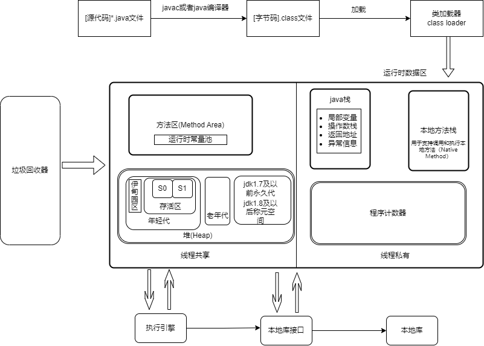

# jvm体系结构

1. **方法区（Method Area）**：方法区是属于 Java 虚拟机的一部分，用于存储类的结构信息、静态变量、常量池、方法字节码等。它是所有线程共享的内存区域。

2. **程序计数器（Program Counter）**：程序计数器是当前线程执行的字节码指令的位置指示器。它用于记录当前线程正在执行的指令地址，以便在线程切换后能够正确恢复执行。

3. **Java 栈（Java Stack）**：Java 栈是每个线程独有的内存区域，用于存储方法的执行环境和局部变量。它包含了栈帧，每个方法调用都会创建一个栈帧，用于存储方法的局部变量、操作数栈、返回地址和异常处理信息等。

4. **本地方法栈（Native Method Stack）**：本地方法栈是用于支持调用和执行本地方法（Native Method）的内存区域。它类似于 Java 栈，用于管理本地方法的执行，包含本地方法栈帧。

5. **堆（Heap）**：堆是 Java 程序运行时动态分配对象的内存区域。它是所有线程共享的内存区域，用于存储对象实例和数组。

6. **执行引擎（Execution Engine）**：执行引擎是 Java 虚拟机的一部分，负责执行编译后的字节码指令。它将字节码转换为具体机器指令，并执行程序的运算、流程控制等操作。

7. **本地库接口（Native Library Interface）**：本地库接口（JNI）是 Java 提供的一组机制，用于在 Java 程序中调用本地方法。它允许 Java 代码与其他编程语言编写的本地库进行交互。

8. **本地库（Native Library）**：本地库是用其他编程语言（如 C、C++）编写的库，可以通过本地库接口（JNI）与 Java 代码进行交互。本地库提供了对底层系统、硬件或第三方库的访问和操作。

9. **垃圾回收器（Garbage Collector）**：垃圾回收器是 Java 虚拟机的一部分，负责自动管理内存中不再使用的对象的回收。它通过标记未使用对象，然后释放它们所占用的内存空间，以便后续的对象分配和使用。
