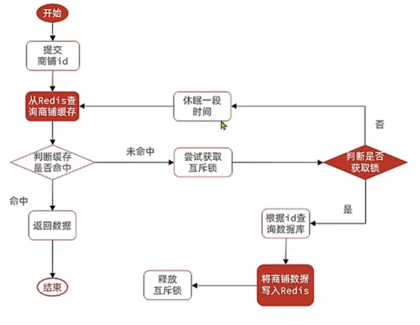
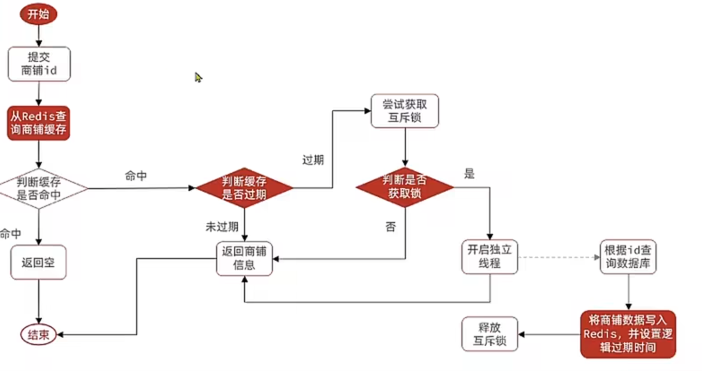

# Redis缓存击穿

1.**什么是缓存击穿**

缓存击穿问题也叫热点key问题，就是一个被高并发且缓存重建业务复杂的key失效，导致无数的请求会在瞬间给数据库带来巨大的压力

2.**常见的解决办法**

1. 追求一致：互斥锁：  
   互斥锁是一种并发控制机制，用于保证在同一时间内只有一个线程或进程可以执行特定的代码块。在缓存失效的情况下，可以使用互斥锁来控制只有一个请求能够访问后端数据库，其他请求则等待获取锁后再访问缓存或数据库。
   
   实现步骤：
   
   - 当一个请求发现缓存失效时，尝试获取互斥锁。
   - 如果获取到锁，则该请求负责重新加载数据到缓存中，并释放锁。
   - 如果未获取到锁，则其他请求等待锁的释放，并直接从缓存中获取数据。
   - 
   
   ```java
        private Result queryWithMutex(Long id) {
           String key = LOCK_SHOP_KEY + id;
           try {
   //        没命中
   //        3.是否能通过锁获取到数据
   //        3.1 没获得锁 等待一段时间从新竞争锁
               Boolean lock = null;
               do {
   //        1.从redis里查询数据
                   String shopJson = stringRedisTemplate.opsForValue().get(CACHE_SHOP_KEY + id);
   //        2.命中返回(StrUtil.isNotBlank: !=null,!=不可见字符,!="")
                   if (StrUtil.isNotBlank(shopJson)){
                       Shop shop = JSONUtil.toBean(shopJson, Shop.class);
                       return Result.ok(shop);
                   }
   //        防止缓存穿透 (shopJson 为 "" 的情况)
                   if (Objects.equals(shopJson, "")){
                       return Result.fail("店铺不存在！");
                   }
                   lock = tryLock(key);
                   if(!lock){
                       Thread.sleep(50);
                   }
               }while (!lock);
   //        3.2  获得锁 去mysql里查
               Shop shop = getById(id);
   //        4.查到了返回前端并把数据写入redis
               if (shop != null){
                   stringRedisTemplate.opsForValue().set(CACHE_SHOP_KEY + id, JSONUtil.toJsonStr(shop), CACHE_SHOP_TTL, TimeUnit.MINUTES);
                   return Result.ok(shop);
               }
   //        5.没查到返回没查到,向redis里存空，防止缓存穿透(设置了两分钟)
               stringRedisTemplate.opsForValue().set(CACHE_SHOP_KEY + id, "", CACHE_NULL_TTL, TimeUnit.MINUTES);
               return Result.fail("店铺不存在！");
           } catch (InterruptedException e) {
               throw new RuntimeException(e);
           } finally {
               unLock(key);
           }
       }
   ```
   
   ```java
       private Boolean tryLock(String key){
           Boolean lock = stringRedisTemplate.opsForValue().setIfAbsent(key, "lock", 30, TimeUnit.SECONDS);
           return BooleanUtil.isTrue(lock);
       }
       private Boolean unLock(String key){
           Boolean delete = stringRedisTemplate.delete(key);
           return BooleanUtil.isTrue(delete);
       }
   ```

   优点：

- 简单易实施，能够有效避免缓存击穿问题。
  
  缺点：

- 增加了系统的复杂性，可能会引入性能瓶颈，需要谨慎设计和选择合适的并发控制机制。
2. 追求性能：逻辑过期：  
   逻辑过期指的是在缓存中设置一个过期时间，并在缓存失效后，只有一个请求负责重新加载数据到缓存中，其他请求直接返回旧的缓存数据，等待新数据加载完成后再更新缓存。
   
   实现步骤：
   
   - 当一个请求发现缓存失效时，尝试获取缓存数据。
   
   - 如果获取到缓存数据，则直接返回给请求者，其他请求共享该数据。
   
   - 如果未获取到缓存数据，则一个请求负责重新加载数据到缓存中，其他请求等待新数据加载完成后再获取缓存数据。
     
     
   
   ```java
           private static final ExecutorService REDIS_EXECUTORS = Executors.newFixedThreadPool(10);
           private Result queryWithLogicalExpire(Long id) {
           //1. 从redis里拿数据
           String shopJson = stringRedisTemplate.opsForValue().get(CACHE_SHOP_KEY + id);
           //2. 如果没有数据就返回null
           if (StrUtil.isBlank(shopJson)){
               return Result.fail("没有缓存，自己去加");
           }
           //3. 有数据就去判断是否过期
           //3.1 把json序列化为RedisData对象
           RedisData redisData = JSONUtil.toBean(shopJson, RedisData.class);
           Shop shop = JSONUtil.toBean((JSONObject) redisData.getData(), Shop.class);
           //4. 没过期就返回数据
           if(redisData.getExpireTime().isAfter(LocalDateTime.now())){
               return Result.ok(shop);
           }
           //5. 过期了就去竞争锁对象
           Boolean lock = tryLock(LOCK_SHOP_KEY + id);
           //6. 获取锁对象成功（没人更新数据），就开辟一个线程去查询数据库，更新redis数据，关闭锁对象
           if (lock){
               REDIS_EXECUTORS.submit(() -> {
                   try {
                       // 保存到redis
                       save2Redis(id, 30L);
                   } catch (Exception e) {
                       throw new RuntimeException(e);
                   } finally {
                       // 解锁
                       unLock(LOCK_SHOP_KEY + id);
                   }
   
               });
           }
           //7.（有人更新数据了）返回旧数据
              return  Result.ok(shop);
           }
   ```
   
   
   
   优点：
   
   - 能够在缓存失效期间保持旧数据的可用性，有效避免缓存击穿问题。
   
   缺点：
   
   - 可能会导致一些请求等待较长时间才能获取到最新的数据，影响实时性。
