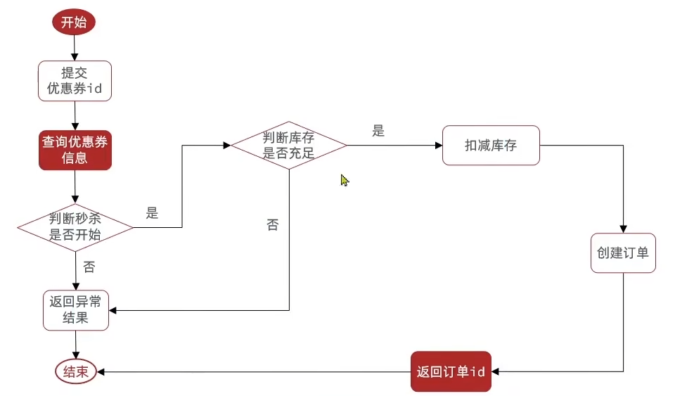
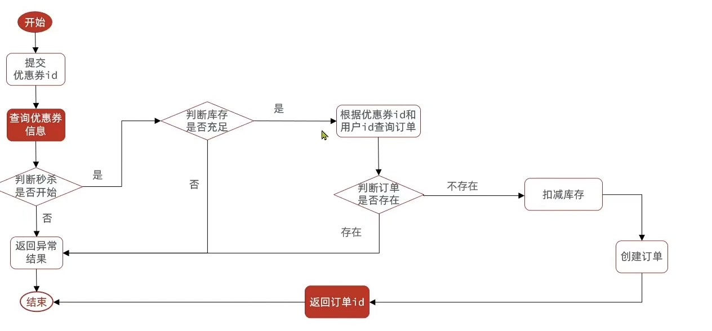

# 秒杀优惠券

1. 下单功能
   
   

```java
@Transactional
    public Result seckillVoucher(Long voucherId) {
        //1. 根据查询查询秒杀券
        SeckillVoucher seckillVoucher = seckillVoucherService.getById(voucherId);
        //2. 判断秒杀是否开始
        LocalDateTime beginTime = seckillVoucher.getBeginTime();
        if (beginTime.isAfter(LocalDateTime.now())){
            return Result.fail("秒杀还未开始!");
        }
        //3. 秒杀是否结束
        LocalDateTime endTime = seckillVoucher.getEndTime();
        if (endTime.isBefore(LocalDateTime.now())){
            return Result.fail("秒杀已经结束!");
        }
        //4. 判断库存是否足够
        Integer stock = seckillVoucher.getStock();
        if (stock <= 0){
            Result.fail("库存不足，秒杀结束");
        }
        //5. 扣减库存
        boolean succeed = seckillVoucherService.update().
                setSql("stock = stock - 1").
                eq("voucher_id", voucherId).update();
        if (!succeed){
            return Result.fail("扣减库存失败");
        }
        //6. 创建订单，返回结果
        VoucherOrder voucherOrder = new VoucherOrder();
        long orderId = redisIdWorker.nextId("order");
        voucherOrder.setId(orderId);
        voucherOrder.setUserId(UserHolder.getUser().getId());
        voucherOrder.setVoucherId(voucherId);
        save(voucherOrder);
        return Result.ok(orderId);
    }
```

但是为了预防并发导致的超卖问题，要加锁

乐观锁（CAS算法实现）更新的时候一起判断库存是否改变就好

```java
//5. 扣减库存
        boolean succeed = seckillVoucherService.update().
                setSql("stock = stock - 1").
                eq("voucher_id", voucherId)
                .eq("stock",seckillVoucher.getStock()).update();
```

安全是安全了，但是sql不执行的此处多，导致商品卖不完，所以要改一下语句 (stock > 0)

```java
boolean succeed = seckillVoucherService.update().
                setSql("stock = stock - 1").
                eq("voucher_id", voucherId)
                .gt("stock",0).update();
```

为了防止一个人买多个优惠券 实现一人一单



```java
@Transactional
    public Result seckillVoucher(Long voucherId) {
        //1. 根据查询查询秒杀券
        SeckillVoucher seckillVoucher = seckillVoucherService.getById(voucherId);
        //2. 判断秒杀是否开始
        LocalDateTime beginTime = seckillVoucher.getBeginTime();
        if (beginTime.isAfter(LocalDateTime.now())){
            return Result.fail("秒杀还未开始!");
        }
        //3. 秒杀是否结束
        LocalDateTime endTime = seckillVoucher.getEndTime();
        if (endTime.isBefore(LocalDateTime.now())){
            return Result.fail("秒杀已经结束!");
        }
        //4. 判断库存是否足够
        Integer stock = seckillVoucher.getStock();
        if (stock <= 0){
            Result.fail("库存不足，秒杀结束");
        }
        //5. 判断用户是否买过优惠券
        Long userId = UserHolder.getUser().getId();
        Long count = query().eq("user_id", userId).eq("voucher_id", voucherId).count();
        if (count > 0){
            return Result.fail("用户已经购买过一次！");
        }
        //6. 扣减库存
        boolean succeed = seckillVoucherService.update().
                setSql("stock = stock - 1").
                eq("voucher_id", voucherId)
                .gt("stock",0).update();
        if (!succeed){
            return Result.fail("扣减库存失败");
        }
        //7. 创建订单，返回结果
        VoucherOrder voucherOrder = new VoucherOrder();
        long orderId = redisIdWorker.nextId("order");
        voucherOrder.setId(orderId);
        voucherOrder.setUserId(userId);
        voucherOrder.setVoucherId(voucherId);
        save(voucherOrder);
        return Result.ok(orderId);
    }
```

这样在查询用户是否已经购买的时候还是会有并发问题

所以给查询用户是否购买到创建订单加锁（锁对象为用户ID的字符串常量），加事务

但是锁在事务内部时，有可能在锁释放到事务提交之间有并发问题

所以把锁加在方法外面

但是spring的事务的提交是通过代理类的，在方法外调用方法是真实的类直接调用的，所以事务会失效，所以要获取代理类来调用方法.

```java
@Override
    public Result seckillVoucher(Long voucherId) {
        //1. 根据查询查询秒杀券
        SeckillVoucher seckillVoucher = seckillVoucherService.getById(voucherId);
        //2. 判断秒杀是否开始
        LocalDateTime beginTime = seckillVoucher.getBeginTime();
        if (beginTime.isAfter(LocalDateTime.now())){
            return Result.fail("秒杀还未开始!");
        }
        //3. 秒杀是否结束
        LocalDateTime endTime = seckillVoucher.getEndTime();
        if (endTime.isBefore(LocalDateTime.now())){
            return Result.fail("秒杀已经结束!");
        }
        //4. 判断库存是否足够
        Integer stock = seckillVoucher.getStock();
        if (stock <= 0){
            Result.fail("库存不足，秒杀结束");
        }
        Long userId = UserHolder.getUser().getId();
        synchronized (userId.toString().intern()){
            IVoucherOrderService voucherOrderService = (VoucherOrderServiceImpl) AopContext.currentProxy();
            return voucherOrderService.creatOrder(voucherId);
        }
        
    }
@Transactional
    public Result creatOrder(Long voucherId) {
        //5. 判断用户是否买过优惠券
        Long userId = UserHolder.getUser().getId();
        Long count = query().eq("user_id", userId).eq("voucher_id", voucherId).count();
        if (count > 0){
            return Result.fail("用户已经购买过一次！");
        }
        //6. 扣减库存
        boolean succeed = seckillVoucherService.update().
                setSql("stock = stock - 1").
                eq("voucher_id", voucherId)
                .gt("stock",0).update();
        if (!succeed){
            return Result.fail("扣减库存失败");
        }
        //7. 创建订单，返回结果
        VoucherOrder voucherOrder = new VoucherOrder();
        long orderId = redisIdWorker.nextId("order");
        voucherOrder.setId(orderId);
        voucherOrder.setUserId(userId);
        voucherOrder.setVoucherId(voucherId);
        save(voucherOrder);
        return Result.ok(orderId);
    }
```


