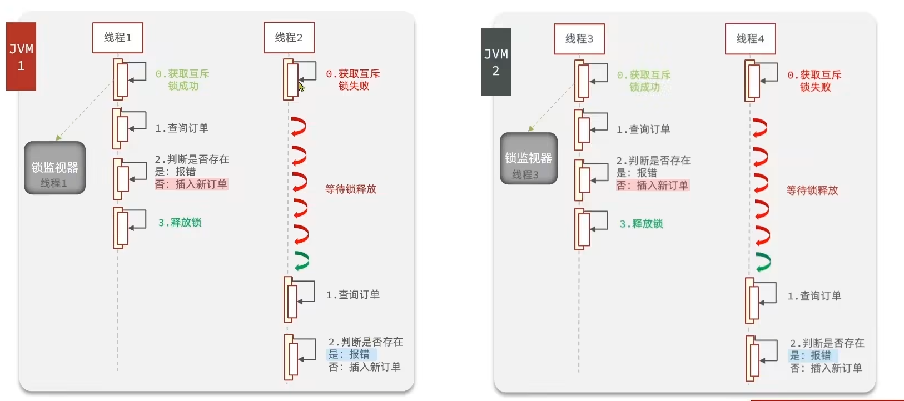
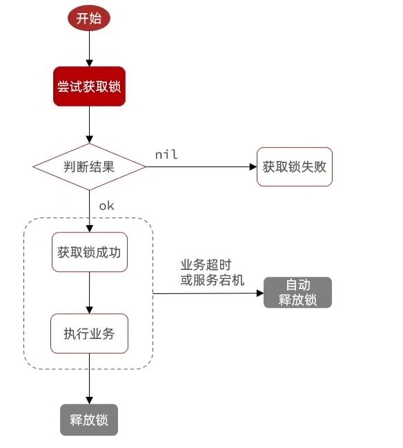
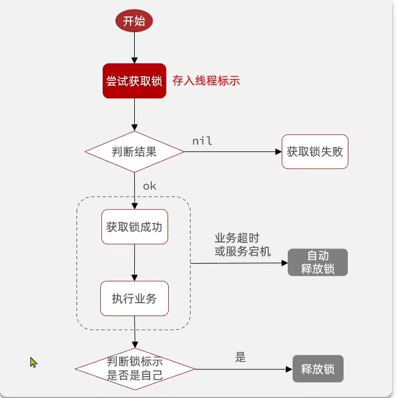

# 分布式锁

在单体架构下加互斥锁固然有用，由于锁对象是JVM提供的，但是在集群的情况下，每个服务器都会有一个独立的JVM，有个多个JVM的锁对象，当然锁不住线程了



这时候就引入了分布式锁的概念

### 什么是分布式锁：

满足分布式系统或集群模式下多进程可见并且互斥的锁

特性：

- 多线程可见

- 互斥

- 高可用

- 安全性

- 高性能

### 分布式锁的实现

|     | MySQL         | Redis       | Zookeeper        |
| --- | ------------- | ----------- | ---------------- |
| 互斥  | mysql本身的互斥锁机制 | 利用setnx互斥命令 | 利用节点的唯一性和有序性实现互斥 |
| 高可用 | 好             | 好           | 好                |
| 高性能 | 一般            | 好           | 一般               |
| 安全性 | 断开连接，自动释放锁    | 利用key的过期机制  | 临时节点，断开连接自动释放    |

基本流程



```java
private static final String KEY_PREFIX = "lock:";
private String name;
private StringRedisTemplate stringRedisTemplate;
    public boolean tryLock(long timeoutSec) {
        // 获取线程标示
        String threadId = Thread.currentThread().getId();
        // 获取锁
        Boolean success = stringRedisTemplate.opsForValue()
                .setIfAbsent(KEY_PREFIX + name, threadId, timeoutSec, TimeUnit.SECONDS);
        return Boolean.TRUE.equals(success);
    }
```

```java
@Override
    public void unlock() {
        stringRedisTemplate.delete(KEY_PREFIX + name);
    }
```

但是这样的流程有一个问题:这个key是业务前缀+用户Id来锁住一个用户，但是当业务需求不是一人一单的情况下，而恰好这个用户抢到锁，但因为某种原因阻塞了，导致锁被超时释放了，恰好另一个线程，也是这个用户抢到了锁，刚好前一个阻塞的任务完成了，又要释放锁（锁被超时释放了）就会把这个任务的锁释放，导致了并行问题

所以我们在释放锁的时候加一个判断：判断当前的线程是不是我们加锁的线程（线程信息存在value里）

注意：加锁的逻辑也要改一改，因为我们要往value里存线程号，线程号的本质就是递增的数字，在多个虚拟机下线程号也有可能一样，所以要加工一下，可以用UUID，也可以其他唯一ID的生成策略 去拼接线程号

流程图为：



```java
private static final String KEY_PREFIX = "lock:";
private static final String ID_PREFIX = UUID.randomUUID().toString(true) + "-";
    public boolean tryLock(long timeoutSec) {
        // 获取线程标示
        String threadId = ID_PREFIX + Thread.currentThread().getId();
        // 获取锁
        Boolean success = stringRedisTemplate.opsForValue()
                .setIfAbsent(KEY_PREFIX + name, threadId, timeoutSec, TimeUnit.SECONDS);
        return Boolean.TRUE.equals(success);
    }
```

```java
    public void unlock() {
        // 获取线程标示
        String threadId = ID_PREFIX + Thread.currentThread().getId();
        // 获取锁中的标示
        String id = stringRedisTemplate.opsForValue().get(KEY_PREFIX + name);
        // 判断标示是否一致
        if(threadId.equals(id)) {
            // 释放锁
            stringRedisTemplate.delete(KEY_PREFIX + name);
        }
    }
```

但是还是有个极端的情况：在我这个线程完整的执行了任务，也判断了我可以成功的删掉自己的锁，但是，因为判断和删除不是原子性的，我在判断成功后要删锁的时候被阻塞了，还是会出现上面一样的问题，由于判断了自己可以删除，但是阻塞时间足够长，导致锁被释放，别的线程进来，阻塞结束，把别人的锁删除了。

方法：用lua脚本实现命令原子性

```java
if ARGV[1] == redis.call('get', KEYS[1]) then
    return redis.call('del', KEYS[1]))
end
return 0
```

```java
private static final DefaultRedisScript<Long> UNLOCK_SCRIPT;
    static {
        UNLOCK_SCRIPT = new DefaultRedisScript<>();
        UNLOCK_SCRIPT.setLocation(new ClassPathResource("unlock.lua"));
        UNLOCK_SCRIPT.setResultType(Long.class);
    }
```

```java
public void unlock() {
        // 调用lua脚本
        stringRedisTemplate.execute(
                UNLOCK_SCRIPT,
                Collections.singletonList(KEY_PREFIX + name),
                ID_PREFIX + Thread.currentThread().getId());
    }
```

就大功告成了

**这样的锁虽然相对完善，但还有缺陷**

1. 不可重入：同一个线程无法多次获取同一把锁，如果有个银行转账，就要对**转账账户**和**被转账账户**都加锁，才能保证数据的一致性。如果A账户想给A账户的子账户转账，一开始拿到转账账户A，又要拿被转账用户A的时候就会拿不到锁导致阻塞。
   
   所以有了可重入锁：可重入锁是一种允许同一个线程多次获取同一个锁的锁。当线程尝试获取已经持有的锁时，它就会成功获取，而不会被阻塞。可重入锁会为每个线程维护一个获取锁的计数器，线程每次获取锁时，计数器会加1，释放锁时，计数器会减1。只有当计数器归零时，锁才会完全释放。

2. 不可重试：没抢到锁就返回，没有重试机制

3. 超时释放：释放锁有点草率，有安全隐患

4. 主从一致：Redis的主从集群，主从同步存在延迟，当主宕机时，从同步主的数据时没有得到主传过来的信号标识，导致并发。

引入工具Redisson：分布式锁的工具
