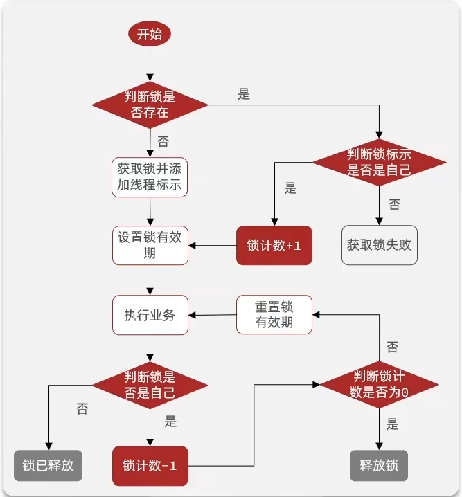

# 重入锁的原理



加锁

```java
--设置key的值
local key = KEYS[1]
local ThreadId = ARGV[1]
local releaseTime = ARGV[2]
--如果key不存在，则设置key的filed为ThreadId,value为1，并设置key的过期时间，返回1
if (redis.call('exists', key) == 0) then
redis.call('hset',  key, ThreadId, '1')
redis.call('expire', key, releaseTime)
return 1
end
--如果key存在，则判断ThreadId是否存在，如果存在，则将ThreadId的值加1，并重置key的过期时间，返回1
if (redis.call('hexists', key, ThreadId) == 1) then
redis.call('hincrby', key, ThreadId, 1)
redis.call('expire', key, releaseTime)
return 1
end
--如果ThreadId不存在，则返回0
return 0
```

解锁

```java

```
