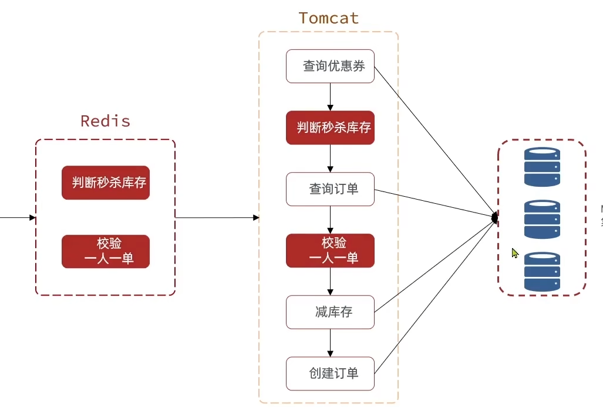

# 用异步来优化

同步虽然一致性高。但是效率也低，用异步处理的方法可以提高效率

 可以把判断校验功能改成异步队列的形式



具体怎么做呢，判断库存和校验直接又要有原子性，所以直接使用lua脚本来保证

```java
local voucherId = ARGV[1]
local userId = ARGV[2]
local stockKey = 'seckill:stock:' .. voucherId
local orderKey = 'seckill:order:' .. voucherId
-- 判断库存是否充足
if (tonumber(redis.call('get', stockKey)) <= 0) then
    -- 库存不足
    return 1
end
-- 判断用户是否下单
if (redis.call('sismember', orderKey, userId) == 1) then
    -- 用户已经下过单
    return 2
end

-- 扣库存
redis.call('decrby', stockKey, 1)
-- 把用户加入已下单集合
redis.call('sadd', orderKey, userId)
return 0
```

这段lua脚本做了校验，根据lua的返回值来决定是否去操作数据库

```java
public Result seckillVoucher(Long voucherId) {
        Long userId = UserHolder.getUser().getId();
        // 执行lua脚本
        Long result = stringRedisTemplate.execute(
                SECKILL_SCRIPT,
                Collections.emptyList(),
                voucherId.toString(), userId.toString()
                );
        // 判断lua脚本的执行情况 1,2不成功, 0成功,不成功返回错误信息
        if (result != 0){
            return Result.fail(result == 1 ?  "库存不足，秒杀失败" : "重复秒杀");
        }
        long orderId = redisIdWorker.nextId("order");
        // 成功将任务放入异步阻塞队列
        VoucherOrder voucherOrder = new VoucherOrder();
        voucherOrder.setId(orderId);
        voucherOrder.setUserId(userId);
        voucherOrder.setVoucherId(voucherId);
        orderTasks.add(voucherOrder);
        voucherOrderService = (IVoucherOrderService) AopContext.currentProxy();
        // 返回成功信息
        return Result.ok(orderId);
    }
```

把成功的请求塞入队列中，等子线程去去了队列就行


那么子线程就要不断的检索有没有任务在队列里，有就处理，没有就等着

```java
private static final ExecutorService SECKILL_EXECUTOR = Executors.newSingleThreadExecutor();
    @PostConstruct
    private void init(){
        SECKILL_EXECUTOR.submit(new VoucherOrderHandler());
    }
    private class VoucherOrderHandler implements Runnable{

        @Override
        public void run() {
            while (true){
                try {
                    //从阻塞队列中获取订单
                    VoucherOrder voucherOrder = orderTasks.take();
                    //创建订单
                    perCreateOrder(voucherOrder);
                } catch (Exception e) {
                    e.printStackTrace();
                }
            }
        }
    }
```

但是这种消息队列，是用JVM的阻塞队列实现的，1.受jvm空间的影响 2.数据不能持久化

# Redis 实现消息队列的三种方式

1. List
   
   可以用LPUSH结合RPOP或者RPUSH和LPOP实现队列
   
   利用BRPOP和BLPOP实现阻塞队列
   
   优点：
   
   利用Redis存储不受限于JVM内存上限
   
   基于Redis的持久化，保证数据安全
   
   可以满足消息有序性
   
   缺点：
   
   无法避免消息丢失（BRPOP是get+del）
   
   只支持单消费者

2. PubSub(发布订阅)
   
   subscribe channel [channel] : 订阅一个或多个频道
   
   publish channel msg : 向一个频道发送信息
   
   psubsrcibe pattern：订阅与pattern格式匹配的所有频道 
   
   优点：
   
   采用订阅模型，支持多生产，多消费
   
   缺点：
   
   不支持数据持久化
   
   无法避免消息丢失
   
   消息堆积有上限，超出时数据丢失

3. Stream（5.0后全新数据类型）
   
    XADD key [nomkstream(队列不存在是否自动创建，默认自动创建)] [消息队列最大消息数] ID(消息唯一id * redis自动生成，格式是时间戳-递增数字) field string [field string ...] 向stream里加一条消息
   
   `xadd users * name jack age 21`
   
   XREAD [COUNT count] [BLOCK milliseconds] STREAMS key [key ...] ID(起始id 0：从第一个 $：从最新的) [ID ...]
   
   `xread COUNT 1 STREAMS user 0`
   
   `xread COUNT 1 BLOCK 0 STREAM user $`
   
   $可能造成消息的漏读
   
   优点：
   
   消息可回溯
   
   消息可被多个消费者读取
   
   可以阻塞读取
   
   缺点：
   
   可能有消息的漏读
   
   # 消费者组
   
   - 消息分流：队列中的消息会分流给组内的不同消费者，而不是重复消费，从而加快消息的处理速度
   
   - 消息标识：消费者组会维护一个标识，记录最后一个被处理的消息，哪怕消费者宕机重启，还会从标识之后读取消息。确保每一个消息都会被消费
   
   - 消息确认：消费者获取消息后，消息处于pending状态，并存入一个pending-lilst。当处理完成后需要通过XACK来确认消息，标识消息已处理，才会从pending-list中移除

创建消费者组：`XGROUP CREATE key groupName ID [MKSTREAM]`

key: 队列名称

groupName：消费者组名称

ID：起始ID标识，$代表最后一个消息, 0代表第一个消息

MKSTREAM：队列不存在时自动创建队列


从消费者组读取消息：`XREADGROUP GROUP group consumer [COUNT count][BLOCK milliseconds] [NOACK] STREAMS key[key...] ID[ID...]`

group：消费者组名称

consumer：消费者名称，如果消费者不存在会自动创建一个消费者

count：本次查询的最大数量

BLOCK milliseconds：当前没有消息的最大等待时间

NOACK：无需手动ACK，获取到消息自动确认

STREAMS key：指定队列名称

ID：获取消息的起始ID：

- “ > ”:从下一个消费者开始

- 其他：根据指定id从pending-list中获取已消费但未确认的消息，例如0，是从pending-list中的第一个消息开始


确认消息：`XACK key group ID[ID...]`

查看pending-list的信息：`XPENDING key group [[IDLE min-idle-time] start end count [consumer]`

删除指定消费者组：`XGROUP DESTORY key groupName`

给指定的消费者组添加消费者：`XGROUP CREATECONSUMER key groupName consumerName`

删除消费者组的指定消费者：`XGROUP DELCONSUMER key groupname consumername`


# Redis消息队列实现异步秒杀

需求：

- 创建一个stream类型的消息队列，名为stream.orders
  
  `xgroup create stream.orders g1 0 mkstream `

- 修改lua脚本，在认定有抢购资格后，直接向stream.orders中添加消息，内容包含voucherId，userId，orderId
  
  ```java
  local voucherId = ARGV[1]
  local userId = ARGV[2]
  local orderId = ARGV[3]
  local stockKey = 'seckill:stock:' .. voucherId
  local orderKey = 'seckill:order:' .. voucherId
  -- 判断库存是否充足
  if (tonumber(redis.call('get', stockKey)) <= 0) then
      -- 库存不足
      return 1
  end
  -- 判断用户是否下单
  if (redis.call('sismember', orderKey, userId) == 1) then
      -- 用户已经下过单
      return 2
  end
  
  -- 扣库存
  redis.call('decrby', stockKey, 1)
  -- 把用户加入已下单集合
  redis.call('sadd', orderKey, userId)
  -- 发送消息
  redis.call('xadd', 'stream.orders', '*', 'userId', userId, 'id', orderId, 'voucherId', voucherId)
  return 0
  ```
  
  

- 项目启动时，开启一个线程，尝试获取stream.orders中的消息完成下单

```java
@PostConstruct
    private void init(){
        SECKILL_EXECUTOR.submit(new VoucherOrderHandler());
    }
    private class VoucherOrderHandler implements Runnable{
        String queueName = "stream.orders";
        @Override
        public void run() {
            while (true){
                try {
                    // 从消息队列中获取订单
                    List<MapRecord<String, Object, Object>> list = stringRedisTemplate.opsForStream().read(
                            Consumer.from("g1", "c1"),
                            StreamReadOptions.empty().count(1).block(Duration.ofSeconds(2)),
                            StreamOffset.create(queueName, ReadOffset.lastConsumed())
                    );
                    // 判断是否获取成功
                    if (list == null || list.isEmpty()){
                        // 如果失败说明没有消息，继续下一次
                        continue;
                    }
                    // 如果有消息就创建订单
                    MapRecord<String, Object, Object> record = list.get(0);
                    Map<Object, Object> value = record.getValue();
                    VoucherOrder voucherOrder = BeanUtil.fillBeanWithMap(value, new VoucherOrder(), true);
                    perCreateOrder(voucherOrder);
                    // ACK的确认
                    stringRedisTemplate.opsForStream().acknowledge(queueName, "g1",  record.getId());

                } catch (Exception e) {
                    //重复确认
                    handlePendingList();
                }
            }
        }

        private void handlePendingList() {
            while (true){
                try {
                    // 从pending list中获取消息
                    List<MapRecord<String, Object, Object>> list = stringRedisTemplate.opsForStream().read(
                            Consumer.from("g1", "c1"),
                            StreamReadOptions.empty().count(1),
                            StreamOffset.create(queueName, ReadOffset.from("0"))
                    );
                    // 判断是否获取成功
                    if (list == null || list.isEmpty()){
                        break;
                    }
                    // 如果有消息就创建订单
                    MapRecord<String, Object, Object> record = list.get(0);
                    Map<Object, Object> value = record.getValue();
                    VoucherOrder voucherOrder = BeanUtil.fillBeanWithMap(value, new VoucherOrder(), true);
                    perCreateOrder(voucherOrder);
                    // ACK的确认
                    stringRedisTemplate.opsForStream().acknowledge(queueName, "g1",  record.getId());

                } catch (Exception e) {
                    //重复确认
                    e.printStackTrace();
                }
            }
        }
    }
    


    private void perCreateOrder(VoucherOrder voucherOrder){
        Long userId = voucherOrder.getUserId();
        RLock redisLock = redissonClient.getLock("order:" + userId);
        try {
            boolean lock = redisLock.tryLock(1, 5, TimeUnit.SECONDS);
            if (!lock){
                log.debug("秒杀太火爆，请稍后再试!");
            }
        } catch (InterruptedException e) {
            throw new RuntimeException(e);
        }
        try {
            voucherOrderService.creatOrder(voucherOrder);
        } catch (IllegalStateException e) {
            throw new RuntimeException(e);
        } finally {
            redisLock.unlock();
        }
    }


    @Override
    public Result seckillVoucher(Long voucherId) {
        Long userId = UserHolder.getUser().getId();
        long orderId = redisIdWorker.nextId("order");
        // 执行lua脚本
        Long result = stringRedisTemplate.execute(
                SECKILL_SCRIPT,
                Collections.emptyList(),
                voucherId.toString(), userId.toString(), String.valueOf(orderId)
        );
        // 判断lua脚本的执行情况 1,2不成功, 0成功,不成功返回错误信息
        if (result != 0){
            return Result.fail(result == 1 ?  "库存不足，秒杀失败" : "重复秒杀");
        }

        voucherOrderService = (IVoucherOrderService) AopContext.currentProxy();
        // 返回成功信息
        return Result.ok(orderId);
    }
```


