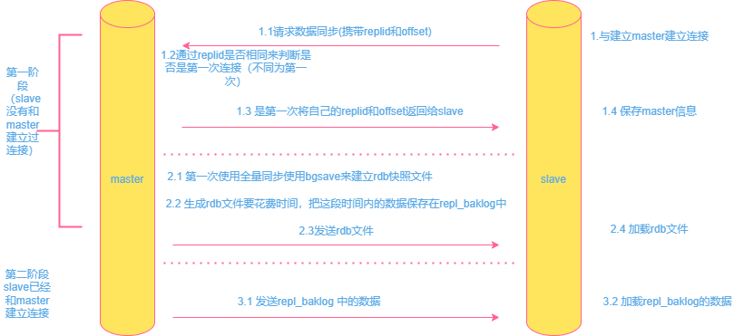

# redis主从

1. 建立复制
   
   - 在配置文件中加入slaveof {masterHost} {masterPort} 随redis启动生效
   
   - 在redis-server启动命令后加入 --slaveof {masterHost} {masterPort}
   
   - 使用命令 slaveof {masterHost} {masterPort}
   
   - 注意如果redis有密码则要在配置文件中同步masterauth

2. 断开复制
   
   - slaveof no one
   
   - 从节点默认只读

3. 原理
   
   

4. 全量同步和增量同步
   
   主从节点在第一次连接时使用全量同步，在后续的数据传输中使用增量同步，但是在slave宕机后，未同步的数据量太大，循环数据repl_baklog的空间不够存储时，会丢失部分的数据，这时候就要全量同步，为了优化这个问题，有几点优化方案
   
   - 在master中配置`repl-diskless-sync yes ` 来开启无磁盘复制，减少磁盘io
   
   - redis单节点上的内存占用不要太大，减少RDB导致过多的磁盘io
   
   - 适当提高repl_baklog的大小，减少未同步数据过多超出repl_baklog空间导致增量同步失败的概率
   
   - 限制一个master上的slave节点数量，如果太多，可以使用主-从-从结构，减少master压力
