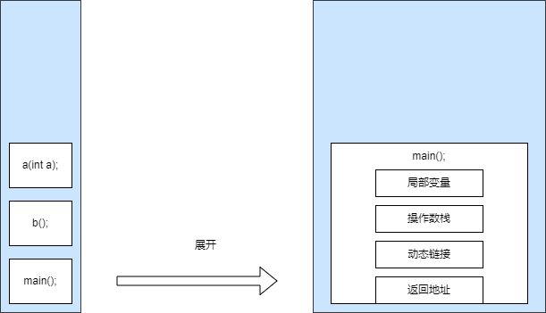

# 栈

在jvm中其实就只有两个栈结构，一个是java虚拟机栈，一个是本地方法栈。

因为他们在大体上是一模一样的所以就放在一起讲

### 1.  栈帧

首先，为了启动一个程序，我们需要一个栈作为执行环境。栈是一种先入后出的数据结构，用于管理方法的调用和执行。在程序启动时，我们需要一个程序的入口方法，通常是`main()`方法。

当我们启动一个程序并调用`main()`方法时，实际上我们将`main()`方法压入栈底。如果`main()`方法中调用了方法`a()`和`b()`，那么`a()`和`b()`也会被依次压入栈底。栈的顶部始终保存着当前正在执行的方法。

执行过程如下：首先，`b()`方法会被调用并压入栈底，然后`a()`方法会被调用并压入栈底。当`a()`方法执行完毕后，栈顶的方法变为`b()`，继续执行`b()`方法。最后，当`b()`方法执行完毕后，栈顶的方法变为`main()`，继续执行`main()`方法。

当`main()`方法执行完毕后，整个程序所在的线程也就结束了，栈中的栈帧会逐步弹出，直到栈为空。

我们提到了程序启动时需要一个栈作为执行环境，并且方法的调用和执行都涉及栈的操作。为了支持方法的调用和执行过程，Java虚拟机使用了栈帧（Stack Frame）的概念。

栈帧是Java虚拟机栈和本地方法栈中的一个重要概念，用于存储方法的执行信息。每个方法在运行时都会创建一个对应的栈帧，栈帧包含了方法的参数、局部变量、操作数栈和动态链接等信息。

现在让我们详细解释一下栈帧的结构：

1. 局部变量区（Local Variable Array）：
   
   - 栈帧中的局部变量区用于存储方法中定义的局部变量。
   - 局部变量可以是基本类型（如int、float）或者引用类型（如对象引用）。
   - 在方法执行期间，局部变量的值被存储在局部变量区中，并且只在方法的作用域内可见。

2. 操作数栈（Operand Stack）：
   
   - 栈帧中的操作数栈用于执行方法中的操作。
   - 操作数栈可以执行各种操作，如算术运算、逻辑运算、方法调用等。
   - 操作数栈的大小在编译时确定，并且在方法执行期间可以动态地扩展和收缩。

3. 动态链接（Dynamic Linking）：
   
   - 栈帧中的动态链接用于支持方法调用过程中的动态绑定。
   - 动态链接将方法调用与实际的方法实现关联起来，以便在运行时解析方法的调用。

4. 方法返回地址（Return Address）：
   
   - 栈帧中的方法返回地址用于记录方法调用完成后的返回位置。
   - 当方法执行完成后，程序将从方法返回地址指示的位置继续执行。

### 2.java虚拟机栈和本地方法栈的关系

我们可以从这个过程来看他们的关系：

1. 当Java程序启动时，JVM会创建一个主线程，并为该线程创建一个Java虚拟机栈。
2. JVM会在主线程的Java虚拟机栈中创建一个栈帧，用于执行main方法。
3. main方法的参数和局部变量将被存储在该栈帧的局部变量区中。
4. main方法中的代码按照字节码指令的顺序被执行。
5. 在执行过程中，方法调用会创建新的栈帧并入栈，执行被调用的方法。
6. 在方法执行完成后，栈帧会被出栈，控制权返回到上一个栈帧继续执行。

在main方法的执行过程中，如果遇到本地方法（使用`native`关键字声明的方法）的调用，JVM会将控制权转移到本地方法栈，并在本地方法栈中创建一个新的栈帧来执行本地方法。本地方法栈的执行过程与Java虚拟机栈类似，都是通过栈帧来支持方法的调用和执行。

### 3. 方法区，堆， 栈的关系

