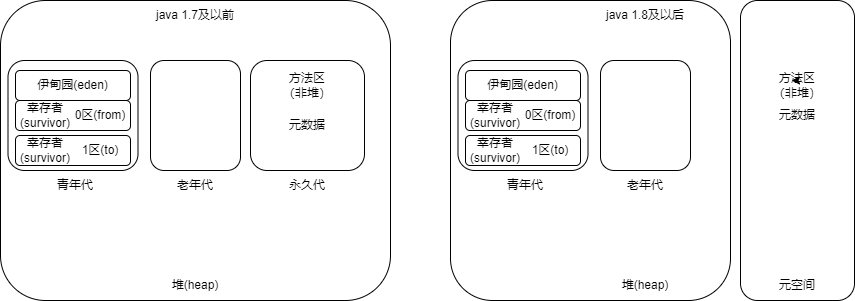

# 堆

首先重新的，细致化的画一下堆的概念图

### 1. 青年代

青年代（Young Generation）：青年代是JVM堆内存中的一部分，用于存放新创建的对象。它被进一步划分为Eden空间和Survivor空间。大多数对象在创建后会被分配到青年代。

1. Eden空间：Eden空间是青年代的一部分，用于存放新创建的对象。当使用`new`关键字创建对象时，它们通常会被分配到Eden空间。如果Eden空间无法容纳新创建的对象，将会触发一次Minor GC（轻GC），对Eden空间进行垃圾回收。

2. Survivor空间：Survivor空间是青年代的一部分，用于存放从Eden空间中幸存下来的对象。当进行一次Minor GC后，Eden空间中仍然存活的对象会被移动到Survivor空间。Survivor空间通常包括两个空间，通常称为From空间和To空间（也称为S0和S1）。在每次Minor GC之间，From空间和To空间会交替使用，存放不同阶段的幸存对象。

3. 轻GC（Minor GC）：轻GC是指对青年代（包括Eden空间和Survivor空间）进行的垃圾回收。它主要针对新创建的对象进行回收，因为大多数对象的生命周期较短，不久就会变成垃圾。轻GC的目标是尽快回收这些短命的对象，以保持青年代的可用空间。

### 2. 老年代

老年代（Old Generation）：青年代是JVM堆内存中的一部分，用于存放长时间存活的对象。通常当青年代，也就是eden和survivor都满了，就把对象存到老年代里。

当老年代都满了就会触发重GC。

1. 重GC（Full GC）：重GC是指对整个堆内存进行的垃圾回收，包括青年代和老年代。它会暂停应用程序的执行，并对堆中所有的对象进行回收。重GC通常发生在老年代空间不足、永久代/元空间空间不足（JDK 1.8之前）或手动触发GC的情况下。

### 3. 永久代/元空间

这个区域是用来存类的元数据，静态变量，方法区，常量池的地方。有人就说了，方法区怎么在堆中呢？其实在jdk1.7的时候，官方就把他移到了堆里了。在jdk1.8以后，官方就把永久代移除了，取而代之的是元空间，在逻辑概念上和以前的永久代是一个东西，方法区也在里面，但是在1.8以后这个元空间就不放在堆里了，使用的是本地内存（**优点：如果方法区无法满足内存分配需求时候会自动拓展，减少了OOM**）移动到叫做“Metaspace”的本地内存（Native memory）中。

### 4. OOM

1. 什么是OOM
   
   Out of Memory（OOM）错误：OOM是指在程序运行时，无法分配更多的内存空间来满足新对象的需求，导致内存耗尽的错误。这种错误通常会导致应用程序崩溃或异常终止。
   
   说人话就是青年代和老年代都满了，对象没地方存了，当然就报错了。

2. 应对方法：
   
   - 优化内存使用：检查代码中的内存泄漏问题，确保及时释放不再使用的对象，避免不必要的对象创建。
   - 调整堆内存大小：通过调整JVM的启动参数，增大堆内存的大小，以便容纳更多的对象。例如，通过修改`-Xmx`参数来增大最大堆内存。
   - 分析内存使用情况：使用内存分析工具（如VisualVM、MAT等）来监控和分析应用程序的内存使用情况，找出内存占用较高的对象或代码段，并进行优化。
   - 优化算法和数据结构：选择更高效的算法和数据结构，减少内存占用。例如，使用缓存、对象池等技术来重用对象，减少对象的创建和销毁。
   - 增加物理内存：如果可行，可以考虑增加物理内存，以提供更多的可用内存供应用程序使用。
   - 分代垃圾回收策略：利用Java堆的分代结构，设置适当的垃圾回收策略，以便更有效地回收内存。例如，调整新生代和老年代的比例，优化垃圾回收算法等。

