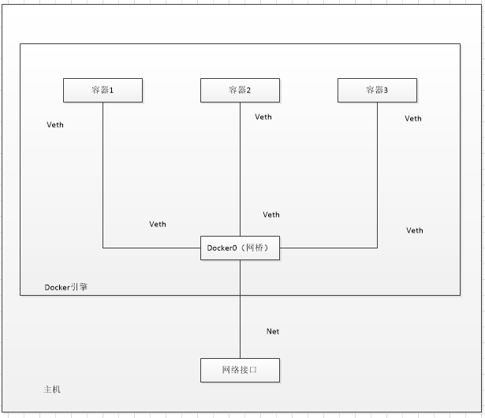
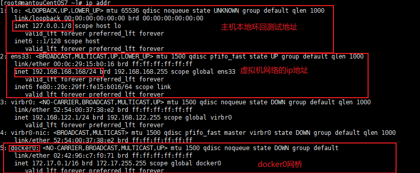
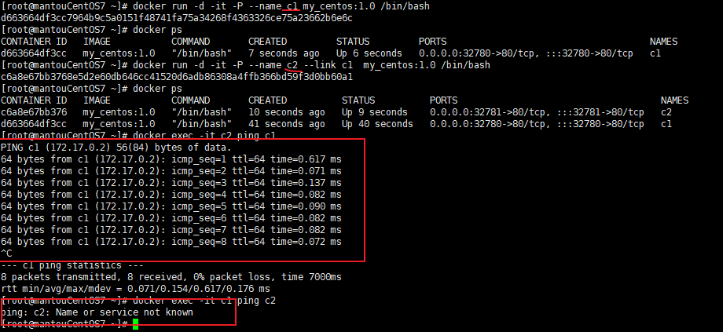
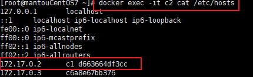
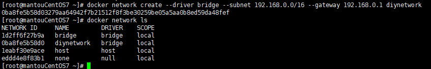
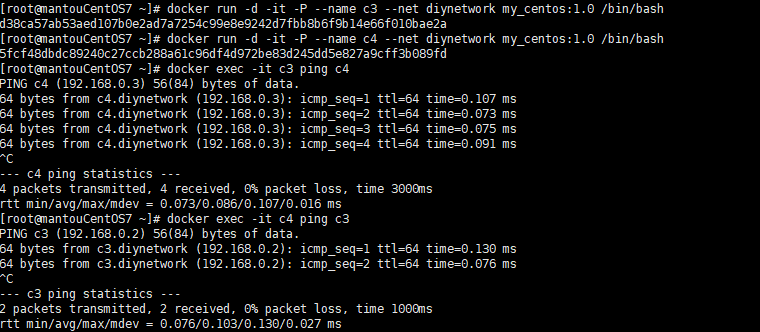

# docker网络

### 1.网络连接常见的三种方式

1. 桥接（Bridge）连接方式：
   
   - 区别：桥接连接方式创建了一个虚拟以太网桥，容器通过桥接与主机和其他容器进行通信。每个容器都有自己的 IP 地址，并且可以通过 IP 地址直接访问。
   - 优势：
     - 提供了较好的网络隔离，每个容器都有独立的 IP 地址和网络命名空间。
     - 容器之间可以通过 IP 地址进行直接通信，不需要进行端口映射。
     - 容器与外部网络的通信可以通过网络地址转换（NAT）实现。
   - 劣势：
     - 桥接连接方式需要为每个容器创建虚拟网络接口，可能会产生一定的开销。
     - 在大规模容器部署中，可能需要进行网络规划和管理，以确保 IP 地址分配的合理性和避免冲突。

2. 主机（Host）连接方式：
   
   - 区别：主机连接方式直接使用主机的网络接口，容器与主机共享网络命名空间和 IP 地址。容器与主机具有相同的 IP 地址和端口空间。
   - 优势：
     - 提供了最低层次的网络隔离，容器与主机共享网络栈和网络配置。
     - 容器可以直接使用主机的 IP 地址和端口，与外部网络进行通信。
     - 主机连接方式的网络性能较好，因为容器直接使用主机的网络接口，减少了网络转发的开销。
   - 劣势：
     - 容器之间的网络隔离性较差，容器之间的端口不能冲突。
     - 容器与主机共享网络栈，可能会受到主机网络配置的限制。

3. 网络地址转换（NAT）方式：
   
   - 区别：NAT 连接方式使用主机的网络地址转换功能，将容器的内部 IP 地址转换为主机的 IP 地址，从而与外部网络进行通信。
   - 优势：
     - 容器与外部网络的通信通过网络地址转换（NAT）实现，可以将容器服务暴露给外部网络。
     - NAT 方式不需要为每个容器创建虚拟网络接口，减少了网络资源的使用。
     - 外部网络可以使用主机的 IP 地址和映射的端口访问容器，方便网络访问和服务暴露。
   - 劣势：
     - 容器之间的直接通信需要经过网络地址转换，可能会引入一定的性能开销。
     - 由于使用端口映射，可能需要管理和处理端口冲突的问题。

### 2. docker的网络连接方式和过程

提到docker的网络通信，无非是docker的容器和容器之间的通信，容器和主机之间的通信。

**首先谈谈docker是怎么和主机通信的**

在docker运行一个容器的时候，他会默认使用网桥的网络驱动程序创建网络，Docker 桥接是一个虚拟以太网桥（如 `docker0`），它与主机上的物理网络接口相连，并为容器提供网络连接，他会给从默认的 `172.17.0.0/16` 子网中分配给容器一个唯一的IP地址，并用veth pair的技术把容器和网桥连接起来。当容器需要与外部主机通信时，Docker 引擎会通过 IPTables 规则将容器的内部 IP 地址转换为主机上的 IP 地址。

**在来谈谈docker是如何实现容器和容器的通信的**

主要就是依赖与网桥和veth pair，先来讲讲什么是veth pair，veth pair（veth 对）是 Linux 中的虚拟网络设备对，用于连接两个网络命名空间（Network Namespace）。veth pair 包含两个虚拟网络接口，一个在一个命名空间中，另一个在另一个命名空间中，它们通过一个虚拟以太网链路连接起来。简单来说，他就像一条通道，通道的一端连接到docker0（网桥），一端连接到容器内部的网络接口，就这样，通过verh对把一个个容器都和网桥连在一起，通过网桥就可以通信了。

我们怎么能看到这个变化呢，其实在linux里输入`ip addr`命令就行

### 3. 容器互联

在平常我们与其他容器做通讯是通过ip地址，ping 222.111.223.22之类的，这样其实很麻烦又难记，有没有办法能够向ping 域名一样的方法来联通两个容器呢？常见的有两种方法。

**方法一：--link**

我们在docker run 创建容器的时候，其实有个--link的参数，能将容器联通起来

示例：`docker run --link [容器]`

这里我用c2 去 link 的 c1 可以看到 c2能pingc1，c1不能pingc2，这是因为，docker0这个网桥是不支持直接ping名字，所有我们用link，但link实质上就是在主机上配置类似window的host文件去写死的域名

所以他其实也没那么高明，而且是单向的

**方法二：自定义网络**

刚刚说到docker0这个网桥是不支持ping容器名字的，但是自己定义的网络是可以的，

我们可以用docker network 去办到包括它的很多事

`docker network create --driver bridge --subnet 192.168.0.0/16 --gateway 192.168.0.1 diynetwork`我们可以自己定义一个网桥

在docker run 时有个  --net参数可以选择自己定义的网络，不写默认docker0，这运行后就可以互相ping容器名字了

### 4. 网络联通

在我们知道了可以自定义网络后可能就会创建不同的网络，那么docker0网桥和我自建的网桥内的容器之间能ping通吗？当然不行，我们知道docker容器之间的通信是通过docker的网网桥来连接的，网桥都不一样了怎么可能互相通信。

这时候网络联通来了，我们可以通过 `docker network connect [OPTIONS] NETWORK CONTAINER`来实现打通，这样我们所选中的容器就会直接放到我们选择的网络下，所谓一个容器在两个网络分别有一个ip。

